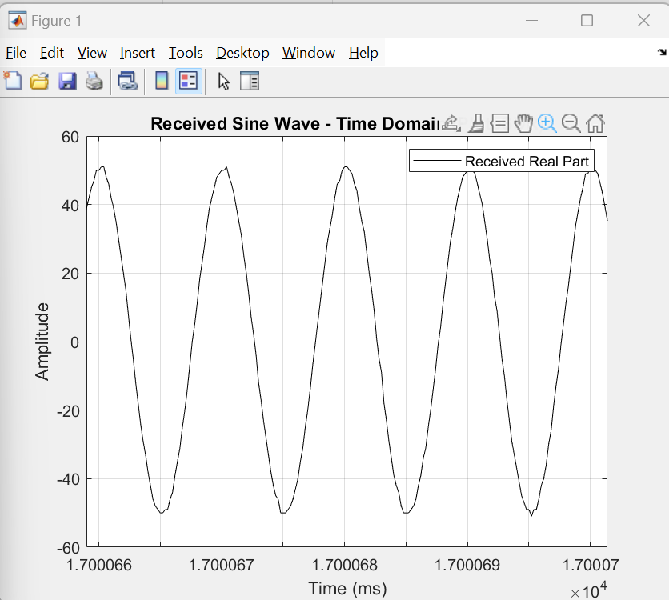
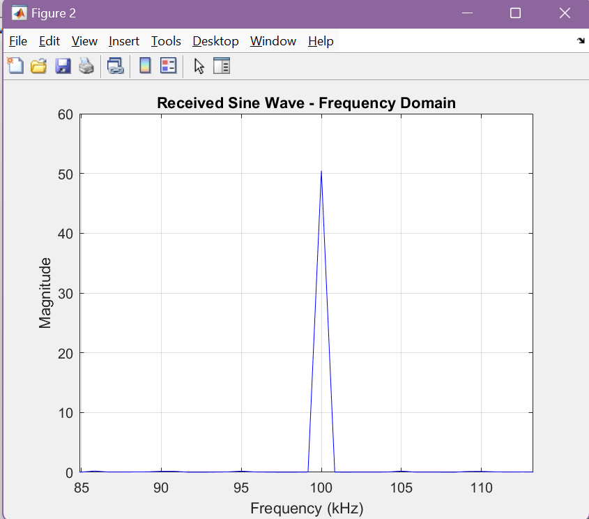

# PlutoSDR Sine Wave Transmit and Receive (Loopback Test)

This MATLAB script demonstrates the **transmission and reception of a 100 kHz complex sine wave** using the **ADALM-PLUTO SDR** in loopback mode. It provides both **time-domain** and **frequency-domain** visualization of the received signal.

---

## Overview

This project transmits a continuous complex sine wave at **100 kHz baseband frequency** using PlutoSDR, receives it back via the same SDR (loopback configuration), and plots the signal in real-time.

---

## Output

### Time-Domain Signal (Received)

### Frequency-Domain Spectrum

## Requirements

- MATLAB with **Communications Toolbox Support Package for ADALM-PLUTO Radio**

- ADALM-PLUTO SDR

- USB connection

- Windows/Linux

